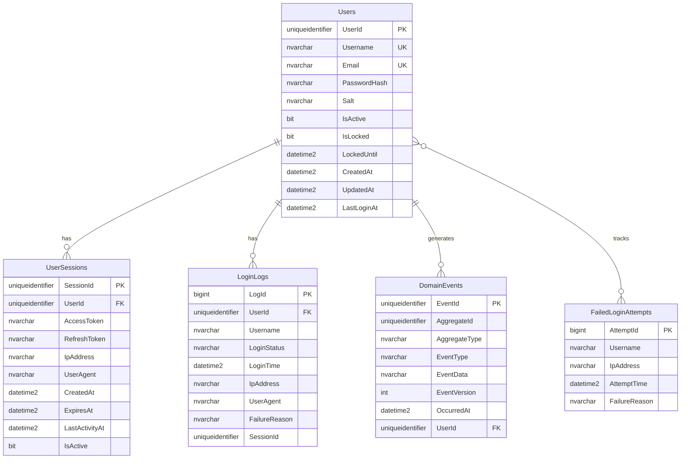

# 登入系統 ER Diagram (Entity Relationship Diagram)

## 資料表關係圖

```
┌─────────────────────────────────────────────────────────────────────┐
│                          登入系統資料庫架構                            │
└─────────────────────────────────────────────────────────────────────┘

┌─────────────────────┐
│      Users          │
│─────────────────────│
│ PK UserId           │◄───────────┐
│    Username         │            │
│    Email            │            │
│    PasswordHash     │            │
│    Salt             │            │
│    IsActive         │            │
│    IsLocked         │            │
│    LockedUntil      │            │
│    CreatedAt        │            │
│    UpdatedAt        │            │
│    LastLoginAt      │            │
└─────────────────────┘            │
         ▲                         │
         │                         │
         │                         │
         │ FK                      │ FK
         │                         │
┌────────┴──────────┐    ┌────────┴──────────┐
│   UserSessions    │    │    LoginLogs      │
│───────────────────│    │───────────────────│
│ PK SessionId      │    │ PK LogId          │
│ FK UserId         │    │ FK UserId         │
│    AccessToken    │    │    Username       │
│    RefreshToken   │    │    LoginStatus    │
│    IpAddress      │    │    LoginTime      │
│    UserAgent      │    │    IpAddress      │
│    CreatedAt      │    │    UserAgent      │
│    ExpiresAt      │    │    FailureReason  │
│    LastActivityAt │    │    SessionId      │
│    IsActive       │    └───────────────────┘
└───────────────────┘
         │
         │ Trigger
         │ (自動記錄)
         ▼
┌─────────────────────┐
│    LoginLogs        │
│  (透過觸發器新增)     │
└─────────────────────┘


┌──────────────────────────┐
│    DomainEvents          │
│──────────────────────────│
│ PK EventId               │
│    AggregateId           │◄─── 關聯到 Users.UserId
│    AggregateType         │     (但非強制 FK)
│    EventType             │
│    EventData (JSON)      │
│    EventVersion          │
│    OccurredAt            │
│ FK UserId                │
└──────────────────────────┘
         ▲
         │
         │ 記錄事件
         │
┌────────┴────────────────┐
│ sp_RecordLoginEvent     │
│ (儲存過程)               │
└─────────────────────────┘


┌──────────────────────────┐
│  FailedLoginAttempts     │
│──────────────────────────│
│ PK AttemptId             │
│    Username              │◄─── 關聯到 Users.Username
│    IpAddress             │     (但非 FK，記錄所有嘗試)
│    AttemptTime           │
│    FailureReason         │
└──────────────────────────┘


┌──────────────────────────┐
│  vw_UserLoginStatus      │
│  (Read Model View)       │
│──────────────────────────│
│  從以下表格彙總:          │
│  - Users                 │
│  - FailedLoginAttempts   │
│  - UserSessions          │
│  - LoginLogs             │
└──────────────────────────┘
```

## 關係說明

### 1. Users → UserSessions (1:N)
- **關係類型**: 一對多
- **外鍵**: `UserSessions.UserId` → `Users.UserId`
- **說明**: 一個使用者可以有多個活躍的會話（多裝置登入）

### 2. Users → LoginLogs (1:N)
- **關係類型**: 一對多
- **外鍵**: `LoginLogs.UserId` → `Users.UserId`
- **說明**: 一個使用者可以有多筆登入日誌記錄

### 3. Users → DomainEvents (1:N)
- **關係類型**: 一對多（弱關聯）
- **關聯**: `DomainEvents.AggregateId` 或 `DomainEvents.UserId` → `Users.UserId`
- **說明**: 使用者的所有領域事件，採用 Event Sourcing 模式

### 4. Users ↔ FailedLoginAttempts (弱關聯)
- **關係類型**: 無直接外鍵
- **關聯**: `FailedLoginAttempts.Username` → `Users.Username`
- **說明**: 記錄所有失敗嘗試，包括不存在的使用者名稱

## 資料流程

### 登入成功流程
```
1. 使用者輸入帳密
2. sp_ValidateLogin 驗證
3. 建立 UserSession 記錄
4. 觸發器自動新增 LoginLogs (Success)
5. sp_RecordLoginEvent 記錄 Domain Event
6. 更新 Users.LastLoginAt
7. 清除 FailedLoginAttempts
```

### 登入失敗流程
```
1. 使用者輸入錯誤帳密
2. sp_ValidateLogin 驗證失敗
3. 新增 FailedLoginAttempts 記錄
4. 檢查失敗次數
5. 如達上限，更新 Users.IsLocked
6. 手動新增 LoginLogs (Failed)
7. sp_RecordLoginEvent 記錄 Domain Event
```

## 索引設計

### 主要索引

| 表格 | 索引類型 | 欄位 | 用途 |
|------|---------|------|------|
| Users | Unique | Username | 快速查找使用者 |
| Users | Unique | Email | Email 查找 |
| Users | Non-Unique | IsActive | 篩選活躍使用者 |
| LoginLogs | Non-Unique | UserId | 查詢使用者登入歷史 |
| LoginLogs | Non-Unique | LoginTime | 時間範圍查詢 |
| FailedLoginAttempts | Composite | Username, AttemptTime | 查詢特定時間範圍內的失敗次數 |
| UserSessions | Non-Unique | UserId | 查詢使用者所有會話 |
| UserSessions | Non-Unique | AccessToken | Token 驗證 |
| DomainEvents | Non-Unique | AggregateId | Event Sourcing 事件重放 |

## 資料完整性

### 參考完整性約束
- ✅ `UserSessions.UserId` REFERENCES `Users.UserId`
- ✅ `LoginLogs.UserId` REFERENCES `Users.UserId`
- ⚠️ `FailedLoginAttempts.Username` 不使用 FK（記錄所有嘗試，包括無效使用者名稱）
- ⚠️ `DomainEvents.AggregateId` 不使用 FK（支援不同 Aggregate 類型）

### CHECK 約束建議
```sql
ALTER TABLE Users 
ADD CONSTRAINT CK_Users_Email 
CHECK (Email LIKE '%@%.%');

ALTER TABLE LoginLogs 
ADD CONSTRAINT CK_LoginLogs_Status 
CHECK (LoginStatus IN ('Success', 'Failed', 'Locked'));

ALTER TABLE UserSessions 
ADD CONSTRAINT CK_UserSessions_ExpiresAt 
CHECK (ExpiresAt > CreatedAt);
```

## 效能考量

### 查詢優化
1. **熱資料分離**: 考慮將 90 天前的 `LoginLogs` 移至歷史表
2. **分割表**: 大量資料時，按月份分割 `LoginLogs` 和 `DomainEvents`
3. **覆蓋索引**: 常用查詢建立 INCLUDE 索引

### 範例覆蓋索引
```sql
CREATE NONCLUSTERED INDEX IX_LoginLogs_UserId_INCLUDE
ON LoginLogs (UserId)
INCLUDE (LoginStatus, LoginTime, IpAddress);
```

## 擴充性設計

### 水平擴展
- **Read Replicas**: 將 Read Model (視圖) 導向唯讀副本
- **分片策略**: 依 UserId 進行 Hash 分片
- **CQRS 分離**: 命令端和查詢端使用不同資料庫

### 垂直擴展
- **欄位擴充**: 預留 JSON 欄位儲存額外資料
- **事件版本**: `DomainEvents.EventVersion` 支援事件結構演進

## Mermaid ER Diagram



## 資料字典

詳細的欄位說明請參考 [login-system-schema.sql](login-system-schema.sql) 中的註解。

## 相關文件

- [README.md](README.md) - 完整架構說明
- [login-system-schema.sql](login-system-schema.sql) - SQL 建立腳本
